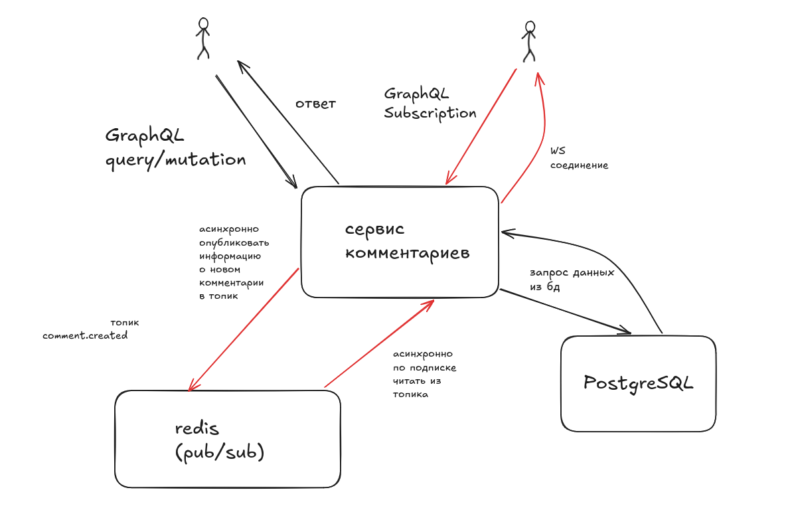

# Архитектура

## Общая схема

Общая схема работы системы имеет следующий вид:


GraphQL-сервис stateless (если не в режиме in memory хранилища) и может масштабироваться горизонтально.
PostgreSQL хранит посты и комментарии.
Redis используется для pub/sub на события о появлении нового комментария под постом.

## Слои приложения

### GraphQL

GraphQL-слой принимает запрос, валидирует аргументы на уровне схемы и вызывает сервисный слой.

### Service

Сервисный слой отвечает за сценарии использования:

- создание поста;
- изменение настройки комментариев;
- создание комментария;
- проверку ограничений;
- публикацию события после успешного сохранения.

### Repository

Репозитории скрывают конкретное хранилище. Один и тот же сервисный слой работает с PostgreSQL и in-memory реализацией.

```go
package comment

type Repository interface {
	Publish(ctx context.Context, comment *domain.Comment) (*domain.Comment, error)
	GetByID(ctx context.Context, id uuid.UUID) (*domain.Comment, error)
	List(ctx context.Context, params ListParams) (*Page, error)
	ListBatch(ctx context.Context, params []ListParams) ([]*Page, error)
}
```

### Дерево комментариев

Комментарии хранятся как список смежности:

```text
comments
├── id
├── post_id
├── parent_id |nullable|
├── author_id
├── body
├── created_at
└── updated_at
```

`parent_id = null` означает корневой комментарий. Глубина дерева не кодируется отдельным полем и не ограничивается схемой.

### DataLoader

Даталоадер создаётся на каждый GraphQL запрос.

Он используется в дочерних резолверах, которые могут быть вызваны для множества объектов:

- `Post.author`;
- `Comment.author`;
- `Post.comments` при чтении списка постов;
- `Comment.replies` при чтении уровня дерева.

## Создание комментария

Создание комментария выполняется в транзакции:

```text
BEGIN
  1. Заблокировать строку поста для чтения (select for share).
  2. Пост существует?
  3. Можно ли добавлять к нему комментарии?
  4. Есть родительский комментарий?
  5. Родительский комментарий точно принадлежит этому посту?
  6. Вставить комментарий.
COMMIT
  7. Опубликовать событие с postId по топику comment.created в Redis.
```

## Subscriptions. Redis Pub/Sub и at-most-once (Почему не Kafka?)

Клиент открывает GraphQL Subscription по вебсокету и подписывается на асинхронные уведомления о новых комментариях к посту.

При создании комментария сервис публикует событие в общий Redis-топик `comment.created`. Каждый экземпляр приложения держит одно Pub/Sub-соединение к этому топику, получает событие и по `postId` раздаёт его нужным GraphQL-подписчикам через in-memory каналы. Количество коннекшенов к Redis не растёт вместе с количеством WebSocket-подписок.

Гарантия доставки - at-most-once: редис не хранит события, поэтому после реконнекта клиент перечитывает актуальные комментарии обычным query.

Kafka, RabbitMQ, NATS (JetStream) не будут выдерживать огромное количество логов/партиций (а у нас может быть огромное количество одновременно подключенных клиентов на подписку), если в них включена персистентность. И, по сравнению с Kafka, отсутствует лишняя репликация и оверхед на контроль консьюмеров.

### Локальный паб-саб

Событие в редисе:

```json
{
  "id": "0198f6de-8f47-7b4e-a564-3fdd37879282",
  "postId": "0198f6dd-bf36-73c4-9ab5-5d43f11bf62b",
  "parentId": "0198f6de-314b-763b-a78b-a32de202bcf1",
  "authorId": "0198f6dc-ea33-7ac8-81ed-f565a5c593ce",
  "body": "Текст комментария",
  "created_at": "2026-07-20T12:34:56.789Z"
}
```

- `id` - UUID созданного комментария;
- `postId` - UUID поста и ключ локальной маршрутизации события;
- `parentId` - UUID родительского комментария; отсутствует у корневого комментария;
- `authorId` - UUID автора;
- `body` - текст комментария;
- `created_at` - время создания в формате RFC 3339.

Каждый экземпляр сервиса создаёт одну постоянную Redis-подписку на `comment.created`. GraphQL Subscription не открывает новое соединение с Redis: сервис создаёт локальный Go-канал и добавляет его в in-memory map подписчиков по `postId`.

Поток события выглядит так:

```text
comment.created в Redis
  -> единственный Redis reader экземпляра сервиса
  -> декодирование payload и получение postId
  -> поиск локальных подписчиков по postId
  -> отправка комментария в их Go-каналы
  -> GraphQL Subscription по WebSocket
```
