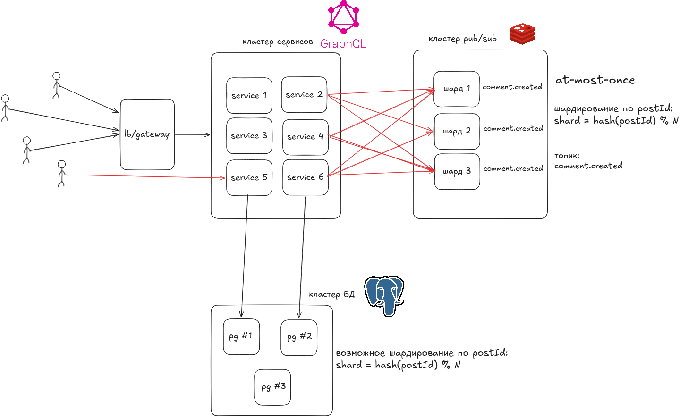

# Масштабирование



## Горизонтальное масштабирование GraphQL

Query и Mutation можно распределять обычным L7-балансировщиком. Вебсокет после подключения остаётся на выбранном экземпляре.

При реконнекте клиент может попасть на другой инстант и поскольку доставка at-most-once, после реконнекта клиент должен перечитать актуальные комментарии обычным query.

Для большого трафика экземпляры сервиса масштабируются независимо от PostgreSQL и Redis:

```text
клиенты
  -> lb/api gateway
     -> сервис #1
     -> сервис #2
     -> сервис #N
```

## Шардирование PostgreSQL

Ключ шардирования - `post_id`:

```text
shard = hash(post_id) % shard_count
```

Пост и все его комментарии должны находиться в одном шарде, чтобы локальными оставались:

- проверка `comments_enabled`;
- проверка родителя;
- вставка комментария;
- чтение корневой страницы;
- чтение ответов;
- `select for share` поста.

Однако шардирование усложняет получение списка постов.

## Шардирование Redis

Сейчас все события комментариев публикуются в общий топик `comment.created`, а каждый экземпляр приложения держит одно Redis Pub/Sub-соединение и локально маршрутизирует события по `postId`.

Если одного Redis станет недостаточно, события можно распределить по шардам по `postId`. Тогда экземпляр приложения держит по одному Pub/Sub-соединению на каждый шард:

```text
shard = hash(postId) % shard_count
```
